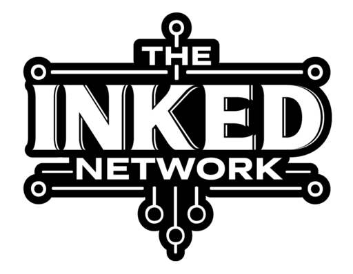

  <strong>Hey! My name is Carlos Aguilera. &nbsp; </strong>
  

 

  
My uptime is better than most servers. Currently at Long Beach State University, I love all things in tech!

## Featured Project

  
  <b>The Inked Network</b> is a modern web application that enables tattoo enthusiasts to explore, connect with, and book artists through interactive portfolios, an AI-enhanced search experience, and a Tinder-style art swiper.

[The Inked Network](https://www.theinkednetwork.com)

 

### Project Highlights
- Built and scaled a full-stack Nuxt + Supabase application, integrating real-time chat, authentication, RLS-based security, and role-based access control.
- Optimized performance and UX with infinite pagination, DOM recycling techniques, LQIP placeholders, and CDN-based image transformations (ImageKit + S3).
- Delivered SEO-driven growth, implementing SSR, Open Graph/Twitter cards, and structured metadata, resulting in strong search visibility and engagement.
- Integrated critical services (Stripe subscriptions, Google Maps API with custom pins, AI-enhanced search, GPT-powered image tagging) into a seamless product experience.
- Driving 200+ user sign-ups and enabling event management, profile customization, and subscription-based monetization.

---

  
  
  
  
  
  
  
  
  
  
  
  
  
  
  
  
  
  
  
  

 
 

  

    
      Visit my
      <a href="https://www.caguilera.dev" target="_blank" rel="noopener noreferrer"
        >Portfolio</a
      >
    
  

  

    
      Connect with me on
      <a
        href="https://www.linkedin.com/in/aguilerac/"
        target="_blank"
        rel="noopener noreferrer"
        >Linkedin</a
      >
    
  

